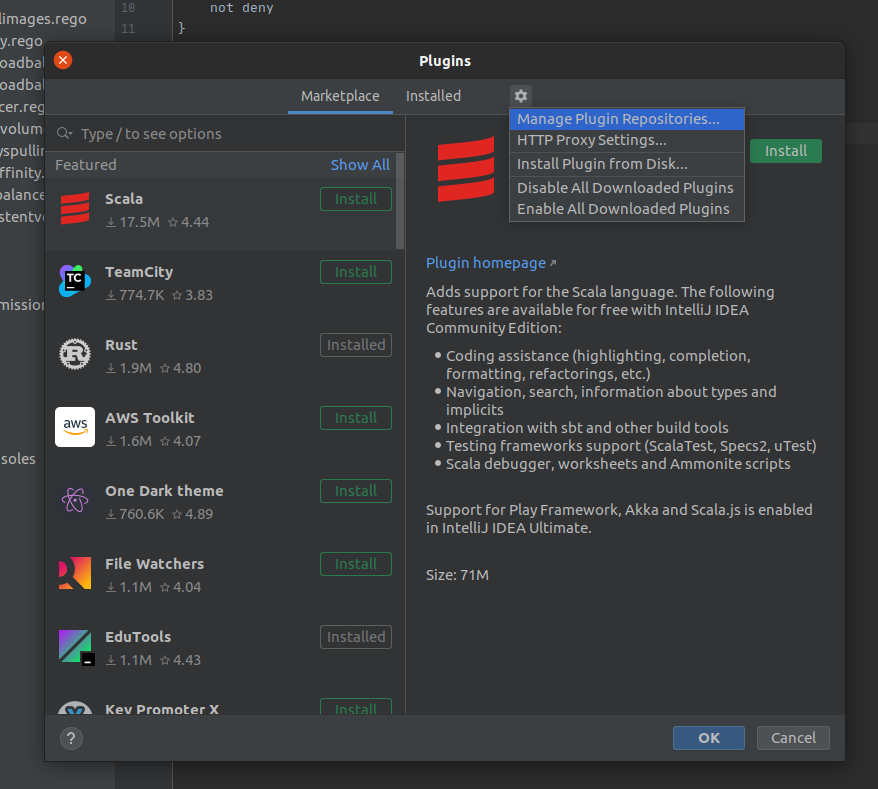
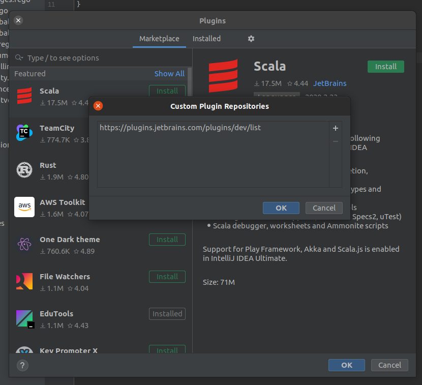

# Opa IntelliJ plugin
A plugin for [IntelliJ](https://www.jetbrains.com/idea/) that provides support for [Open Policy Agent]()

Main features are:
* highlighting
* `opa eval` run configuration
* `opa test` run configuration

# Compatibility

- IDEA products from version `2019.2`
- OPA `0.20.5`

# Status
Not ready yet to be used by  end-users

# Installation 
OPA binary must be in the path.
Installation instructions for OPA can be found [here](https://www.openpolicyagent.org/docs/latest/#running-opa).

## from Jetbrains repository
First, in IntelliJ IDEA, from Preferences>Plugins, add `https://plugins.jetbrains.com/plugins/dev/list` to your Custom Repositories

Then, search "opa" in the Marketplace tab and install the plugin

## from source
You can build the project from source and then install it. Build instructions are available [here](docs/devel/setup_development_env.md)

# Documentation 
User documentation is available [here](docs/user/README.md).

# Contributing
Interesting to contribute ? please start by read this [document](CONTRIBUTING.md)

# Acknowledgment
This project is widely inspired by [rust IntelliJ plugin](https://github.com/intellij-rust/intellij-rust). So thank you
to [JetBrains](https://www.jetbrains.org/) team.
