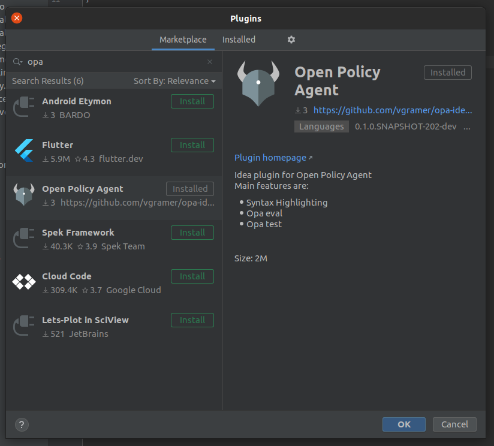

# Opa IntelliJ plugin
A plugin for [IntelliJ](https://www.jetbrains.com/idea/) that provides support for [Open Policy Agent](https://www.openpolicyagent.org/)

Main features are:
* highlighting
* `opa eval` run configuration
* `opa test` run configuration

# Compatibility

The plugin is compatible with all IntelliJ-based IDEs starting from the version 2020.1, with the following differences in the sets of the available features:

|                        | [IntelliJ IDEA] Community and Ultimate (commercial) |Other IDE
|------------------------|---|---|
| Rego project creation  | + | - |
| Other features         | + | + |

Plugin has been tested against OPA `0.20.5`, but should work with more recent versions.

# Installation 
OPA binary must be in the path.
Installation instructions for OPA can be found [here](https://www.openpolicyagent.org/docs/latest/#running-opa).

## from Jetbrains repository
Go to `Settings / Preferences / Plugins` menu. Then, search `opa` in the `Marketplace` tab and install the plugin.

## from source
You can build the project from source and then install it. Build instructions are available [here](docs/devel/setup_development_env.md).

# Documentation 
User documentation is available [here](docs/user/README.md).

# Contributing
Interested in contributing? Please, start by reading this [document](CONTRIBUTING.md).

# Acknowledgment
This project is widely inspired by [rust IntelliJ plugin](https://github.com/intellij-rust/intellij-rust). So, thank you
[JetBrains](https://www.jetbrains.org/) team.
