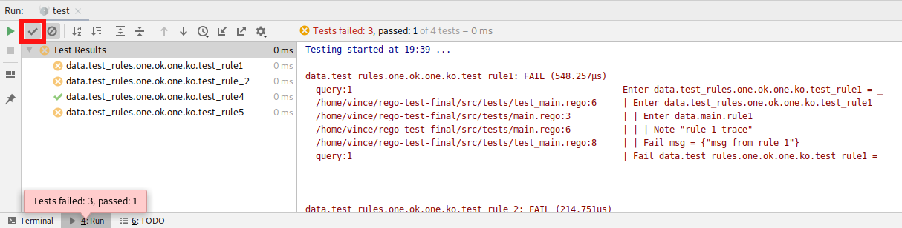

# Table of Content
<!-- toc -->
- [Tests](#tests)
  - [Why is the test duration equal to Zero?](#why-is-the-test-duration-equal-to-zero)
  - [Why does the plugin not display PASS tests?](#why-does-the-plugin-not-display-pass-tests)
<!-- /toc -->

*to update toc, please read [this page](../../hack/README.md).*

# Tests
##  Why is the test duration equal to Zero?
If you don't make an external call (eg HTTP call), the evaluation and test of a policy are really quick (few hundreds of microseconds).
But `IntelliJ` stores duration with millisecond precision. Consequently, if your test takes less than a millisecond to be
executed, it will be shown as `0` in the interface.

Nevertheless, you can see the raw test duration in the output console.

## Why does the plugin not display PASS tests?
By default `IntelliJ` does not show pass tests. To show them you have to click on the "check" icon.

