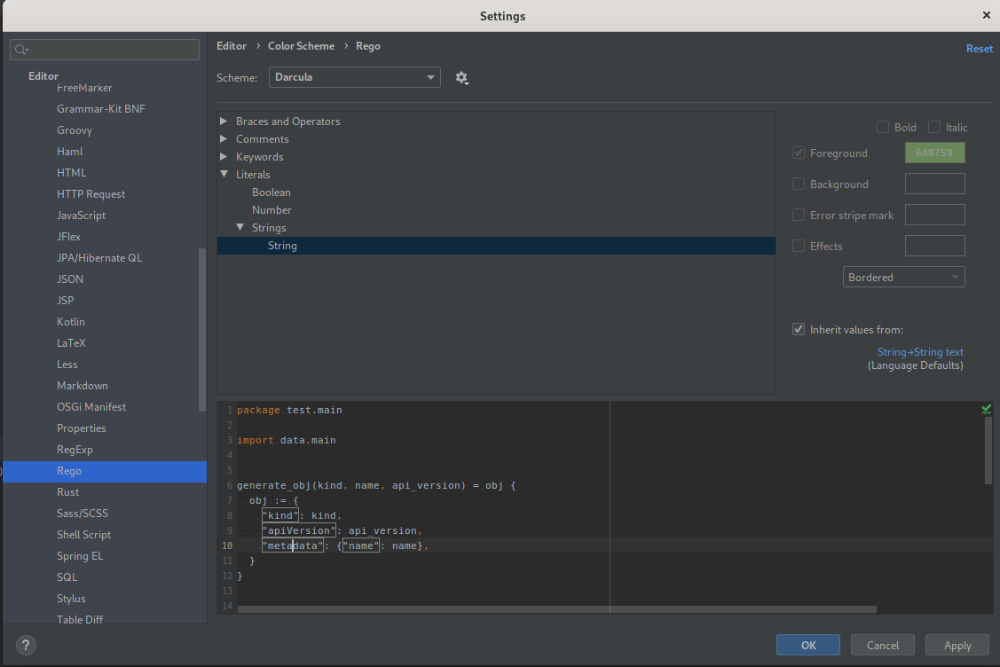

# Change highlighting colors
Go to `Settings` -> `Editor` -> `Color Scheme` -> `Rego` 

In the code preview, if you click on the code element, the correspond color settings will be select in the tree.

