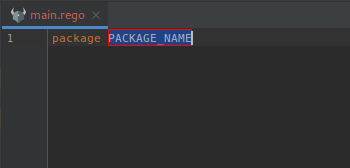
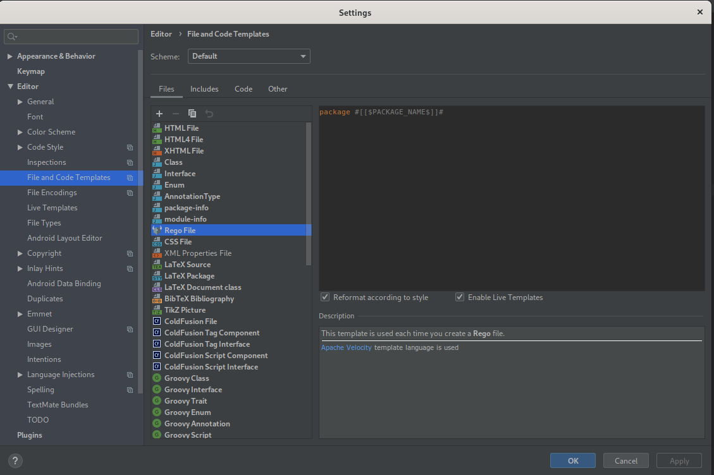

# Create rego file
## Description
This action allows creation of a new `rego file` from a template.

## Trigger the action
In the project tree: right click -> `New` -> `Rego File`. 

The result should look like this:

## Edit the template 
You can edit template using the template editor:
1) click to `File` menu
1) click on `Settings`
1) under `Editor` click on `File and Code Template`
1) click on `Rego File`

